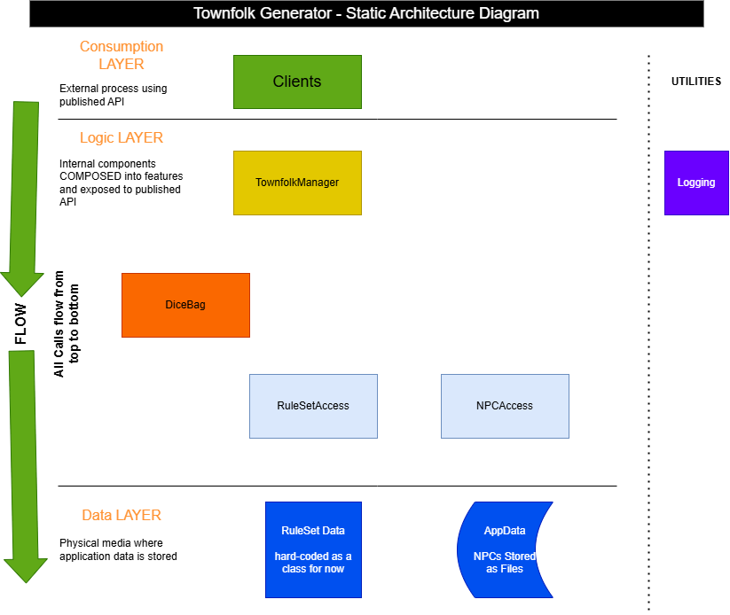

# Architecture

First, define a usable static design. Should include diagrams and descriptions of the different components that will for the overall solution.

Second, detailed design of individual components.

Third, cross referencing components; indentify their dependencies. This helps determines which components need to be built in relative priority.

---

## Static Design

---

### Component Manifest

**Consumption Layer**  
_**Client**_: This, for now, is just a console application.

**Logic Layer**  
_**TownfolkManager**_: Composes the capabilities and functions added to the Engine and ResourceAccess components to perform the different Use Cases when generating NPCs.

_**DiceEngine**_: Handles random number generation using a "rolling dice" metaphor. It will accept arguments that describe how many and what kind of dice, with optional modifiers to results, and optional methods of rolling.

_**NPCAccess**_: Allows user to save and retrieve NPCs as they are generated.

_**RulesetAccess**_: Gives access to various lists and game rules that are required when generating NPCs for a game.

**Data Layer**

_**Ruleset Data**_: Initially will be a set of hard-coded C# classes to keep MVP complexity low.

_**App Data**_: Initially will just store NPCs which are generated in a folder, as one file per character.

---

## Detailed Designs

- /ConsoleClient: Simple console app used to exercise the components, and build a VERY simple (quick and dirty) UI for the app. (very temporary thing...)
- /Managers/GameTools.TownfolkManager: Defines and exposes the Use Cases that the application will facilitate.
- /Engines/GameTools.DiceEngine: Rolls dice, allows for result modifications, and different methods to make rolls.
- /ResourceAccess/GameTools.NPCAccess: Allows user to save and load NPCs which have been generated.
- /ResourceAccess/GameTools.RulesetAccess: Defines common concepts for different rules in Tabletop Roleplaying games.

## Dependency Assessment

| Component       | Dependency                           |
| --------------- | ------------------------------------ |
| Clients         | TownfolkManager\*                    |
| TownfolkManager | DiceEngine, RulesetAccess, NPCAccess |
| DiceEngine      | -                                    |
| RulesetAccess   | collection{of RulesetDefinitions}    |
| NPCAccess       | configured folder on the file system |

> \* The TownfolkManager will initially be referenced directly from the Client. If a web interface is added, and decide to move the Logic into its own discrete service, there will be a need for a web API in front of it. For now, things stay simple.
